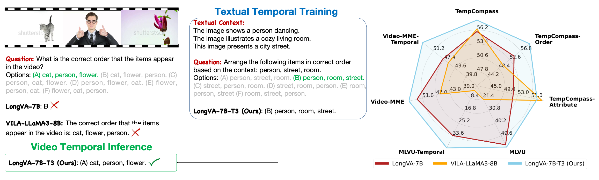

<h2 align="center"> <a href="https://video-t3.github.io/">Temporal Reasoning Transfer from Text to Video</a></h2>

    
    
    
    
    
    
    

    <a href='https://lilei-nlp.github.io/' target='_blank'>Lei Li1*</a> 
    <a href='https://llyx97.github.io/' target='_blank'>Yuanxin Liu2*</a> 
    <a href='https://yaolinli.github.io/' target='_blank'>Linli Yao2</a> 
    <a href='https://veiled-texture-20c.notion.site/Perry-Peiyuan-Zhang-ab24b48621c9491db767a76df860873a' target='_blank'>Peiyuan Zhang3</a> 
     
    <a href='https://scholar.google.com.hk/citations?user=fY69CxIAAAAJ' target='_blank'>Chenxin An1</a> 
    <a href='https://leanwang326.github.io/.github.io/' target='_blank'>Lean Wang2</a> 
    <a href='https://xusun26.github.io/' target='_blank'>Xu Sun2</a> 
    <a href='https://ikekonglp.github.io/' target='_blank'>Lingpeng Kong1</a> 
    <a href='https://leuchine.github.io/' target='_blank'>Qi Liu1</a>

    1The University of Hong Kong 
    2Peking University 
    3UCSD

    *<small>Equal Contribution</small>

# Video-T3

This repo contains official implementation of our paper "Temporal Reasoning Transfer from Text to Video"

## Video LLM Temporal Bootleneck Probing

Please refer to `./probing` for details.

## SFT Data Preparation 

For LongVA experiments, we mix the [Open-LLaVA-NeXT dataset](https://huggingface.co/datasets/Lin-Chen/Open-LLaVA-NeXT-mix1M) with our [T3 dataset](https://huggingface.co/datasets/MMInstruction/Video-T3-QA). The data mixing process is implemented in `t3_sft/data_creation.py`. The script handles:

- Loading and processing Open-LLaVA-NeXT data
- Loading our Video T3 dataset containing various aspects

The data mixing script allows for:

- Customizable dataset ratios (see Table 2 of the main paper and Figure 9 of Appendix for the best practice of mixing datasets.)
- Text length filtering (to avoid OOM when GPU memory is limited )
- Token length analysis and visualization

## SFT Training

### LongVA Training

We use the LongVA codebase for training LongVA models. Please setup the environments according to [LongVA](https://github.com/EvolvingLMMs-Lab/LongVA). The training script is located at `t3_sft/longva_exp/longva_t3.sh`.

### Qwen2VL Models

For Qwen2VL models, we use LLaMa-Factory for fine-tuning. Please setup the environments according to [LLaMa-Factory](https://github.com/hiyouga/LLaMA-Factory). The specific training configurations and scripts for Qwen2VL models could be found under `t3_sft/qwen_exp/7b` and `t3_sft/qwen_exp/72b` for 7B and 72B models, respectively.
